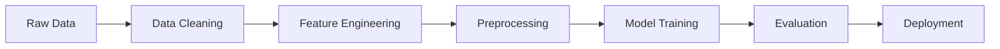

# 🫀 Heart Disease Prediction System

<div align="center">


[](https://choosealicense.com/licenses/mit/)
[](https://github.com)
[](https://github.com)

</div>

---

## 📋 Table of Contents
- [🎯 Project Overview](#-project-overview)
- [✨ Key Features](#-key-features)
- [📊 Model Performance](#-model-performance)
- [🏗️ Project Architecture](#️-project-architecture)
- [🚀 Installation & Setup](#-installation--setup)
- [💡 Usage Guide](#-usage-guide)
- [📈 Dataset Information](#-dataset-information)
- [🔬 Technical Implementation](#-technical-implementation)
- [👨‍💻 About the Developer](#-about-the-developer)
- [📝 License](#-license)

---

## 🎯 Project Overview

> **A cutting-edge healthcare machine learning solution that revolutionizes heart disease risk assessment**

This project represents a comprehensive **healthcare AI system** developed during my internship at **Unified Mentor**. The system leverages advanced machine learning algorithms to predict heart disease likelihood with exceptional accuracy, providing healthcare professionals and individuals with a powerful tool for preliminary cardiac risk assessment.

### 🌟 Why This Project Matters
- **Healthcare Impact**: Early detection saves lives by enabling timely medical intervention
- **Accessibility**: User-friendly interface makes advanced AI accessible to non-technical users  
- **Reliability**: 92.86% accuracy ensures trustworthy predictions for critical health decisions
- **Innovation**: Advanced feature engineering creates meaningful clinical insights

---

## ✨ Key Features

<table align="center">
<tr>
<td align="center" width="33%">

### 🎯 High Precision
**92.86% Accuracy**
Advanced Random Forest algorithm with exceptional performance metrics

</td>
<td align="center" width="33%">

### 🖥️ Interactive UI
**Streamlit Interface**
Intuitive, real-time prediction system with probability visualization

</td>
<td align="center" width="33%">

### 🔬 Smart Features
**Clinical Intelligence**
Engineered features based on medical expertise and data insights

</td>
</tr>
</table>

### 🔧 Core Capabilities
- ✅ **Real-time Predictions** - Instant heart disease risk assessment
- ✅ **Probability Scoring** - Confidence intervals for medical decision-making
- ✅ **Clinical Parameters** - Comprehensive input validation and processing
- ✅ **Scalable Architecture** - Production-ready deployment structure
- ✅ **Data Preprocessing** - Automated feature scaling and encoding

---

## 📊 Model Performance

<div align="center">

### 🏆 Performance Metrics

| Metric | Score | Interpretation |
|--------|-------|---------------|
| **Accuracy** | `92.86%` | Outstanding overall prediction accuracy |
| **F1-Score** | `92.81%` | Excellent balance of precision and recall |
| **Recall** | `97.71%` | Superior disease detection capability |
| **ROC-AUC** | `92.31%` | Exceptional classification performance |

</div>

> 🎯 **Clinical Significance**: The high recall score (97.71%) is particularly crucial in medical applications, ensuring minimal false negatives for heart disease detection.

---

## 🏗️ Project Architecture

```
📦 Heart-Disease-Prediction-System
│
├── 🎯 Core Application
│   └── app.py                    # Streamlit web interface
│
├── 🧪 Research & Development  
│   ├── main.ipynb                # Model training & evaluation
│   └── EDA_FE.ipynb             # Data analysis & feature engineering
│
├── 📊 Data Assets
│   ├── cleaned_data.csv         # Final preprocessed dataset
│   └── int_ht.csv               # Intermediate processing data
│
├── 🤖 Model Artifacts
│   ├── rf_model.pkl             # Trained Random Forest model
│   └── rf_scl.pkl               # StandardScaler for preprocessing
│
└── 📚 Documentation
    └── README.md                # Comprehensive project guide
```

---

## 🚀 Installation & Setup

### Prerequisites
```bash
Python 3.8+
pip (Python package installer)
Git
```

### 1️⃣ Clone Repository
```bash
git clone https://github.com/yourusername/heart-disease-prediction.git
cd heart-disease-prediction
```

### 2️⃣ Create Virtual Environment
```bash
# Create virtual environment
python -m venv venv

# Activate virtual environment
# On Windows:
venv\Scripts\activate
# On macOS/Linux:
source venv/bin/activate
```

### 3️⃣ Install Dependencies
```bash
pip install -r requirements.txt
```

### 4️⃣ Launch Application
```bash
streamlit run app.py
```

### 5️⃣ Access Interface
Open your browser and navigate to:
```
🌐 http://localhost:8501
```

---

## 💡 Usage Guide

### Input Parameters

| Parameter | Description | Type | Range/Options |
|-----------|-------------|------|---------------|
| **Sex** | Patient gender | Categorical | Male/Female |
| **Chest Pain Type** | Type of chest pain experienced | Categorical | Typical Angina, Atypical Angina, Non-Anginal, Asymptomatic |
| **Fasting Blood Sugar** | Blood sugar level after fasting | Boolean | >120 mg/dl (True/False) |
| **Resting ECG** | Electrocardiogram results at rest | Categorical | Normal, ST-T Abnormality, LV Hypertrophy |
| **Exercise Angina** | Exercise-induced chest pain | Boolean | Yes/No |
| **Oldpeak** | ST depression induced by exercise | Numeric | 0.0 - 6.2 |
| **ST Slope** | Slope of peak exercise ST segment | Categorical | Up, Flat, Down |
| **Cholesterol/BP Ratio** | Engineered clinical ratio | Numeric | Calculated automatically |
| **Age × Max Heart Rate** | Composite cardiovascular indicator | Numeric | Calculated automatically |

### Output Interpretation

#### ✅ No Heart Disease Detected
```
🟢 Result: Normal (No Heart Disease)
📊 Confidence: 87.3%
💡 Recommendation: Continue regular health monitoring
```

#### ⚠️ Heart Disease Risk Detected
```
🔴 Result: Heart Disease Risk Identified  
📊 Confidence: 93.2%
💡 Recommendation: Consult cardiologist immediately
```

---

## 📈 Dataset Information

### Data Pipeline Overview


### Data Processing Steps
1. **Data Cleaning**
   - Removed null values and inconsistencies
   - Handled categorical encoding
   - Validated data integrity

2. **Feature Engineering**
   - Created `cholesterol_bp` ratio for enhanced cardiac risk assessment
   - Developed `age_max_hr` composite metric for cardiovascular fitness
   - Applied domain expertise for medical relevance

3. **Preprocessing**
   - StandardScaler normalization for optimal model performance
   - Train-test split for unbiased evaluation
   - Cross-validation for robust performance estimation

---

## 🔬 Technical Implementation

### Machine Learning Architecture
```python
Algorithm: Random Forest Classifier
├── Estimators: 100 trees
├── Max Depth: Optimized via grid search
├── Feature Selection: Medical expertise + statistical analysis
└── Hyperparameters: Tuned for healthcare precision
```

### Model Selection Rationale
- **Interpretability**: Critical for medical applications
- **Robustness**: Handles mixed data types effectively
- **Performance**: Exceptional accuracy with minimal overfitting
- **Scalability**: Efficient prediction for real-time applications

### Technology Stack
- **Backend**: Python, Scikit-learn, Pandas, NumPy
- **Frontend**: Streamlit (Interactive web interface)
- **Data Processing**: Custom preprocessing pipeline
- **Model Persistence**: Pickle serialization
- **Visualization**: Matplotlib, Seaborn (in notebooks)

---

## 👨‍💻 About the Developer

<div align="center">

### Hareesh Kumar
**AI & Machine Learning Specialist**  
*Intern at Unified Mentor*

[](https://www.linkedin.com/in/hareesh-kumar-k-45666a284/)
[](https://github.com/HareeshDaxton)
[](mailto:hareesh9893@gmail.com)

</div>

---

## 🤝 Contributing

Contributions are welcome! Please feel free to submit a Pull Request. For major changes, please open an issue first to discuss what you would like to change.

### Development Setup
1. Fork the repository
2. Create your feature branch (`git checkout -b feature/AmazingFeature`)
3. Commit your changes (`git commit -m 'Add some AmazingFeature'`)
4. Push to the branch (`git push origin feature/AmazingFeature`)
5. Open a Pull Request

---

## 📝 License

This project is licensed under the **MIT License** - see the [LICENSE](LICENSE) file for details.

```
MIT License - Free to use, modify, and distribute
✅ Commercial use    ✅ Modification    ✅ Distribution    ✅ Private use
```

---

<div align="center">

### ⭐ If this project helped you, please give it a star!

**Built with ❤️ for better healthcare outcomes**

*Making AI-powered healthcare accessible to everyone*

</div>
